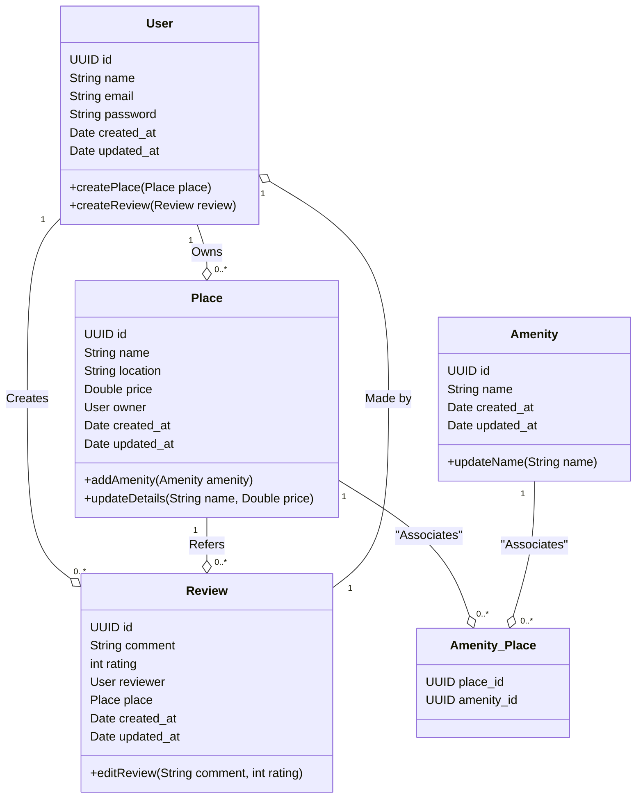

# Diagramme de classes

Cliquez sur ce lien pour consulter le diagramme: [Mermaid Live Editor](https://www.mermaidchart.com/play?utm_source=mermaid_live_editor&utm_medium=banner_ad&utm_campaign=visual_editor#pako:eNqtVE1vwjAM_StWpUndRtG49obGYTvsQ0zcKiHTBpSpTVCaghDiv89N2ioR5UOMHupiPzv2ew77IJUZC-IgzbEsJxxXCotEJQLoMT6YlUzBvvXVz2z2PgGeua4frbhYgcCC9bhZgTzv8a-p_lYqr9IENYNUMTLZHPVRqFpnPaFnm_GdY8pC84Z1_X7sAU3ZhrNtaA0oYzrcof7wCbDl_sdALlPUXApvHFktcupT8dRLMYTLrWDqDrxglo0LJrjehY0FtNanxqZPmCalytAZZuD1eY6ntv6NTN04oHV_UjG363N9NsJf2WYqC5rLO5MLDYrkFKsj2ew2-co563iHeVnGdbPBfocDp68rZJqfWmvT6NznwgSavXFCXnUzfxKMkgCiSNLXy3D4RD_sOTF8bUV5CdtIE8Or4aXD2xodrD_nDY_wpw-YsiVTHb5xuwkjp_WrwGamGD4wY7DYucw8PMD4V1YaKJIj7Uhu_gugQLGLtIxqCxuOQLdMI901rICUkikn3PLiTL6gMQXGTTIRGLTp7e28qUBw-ANs2eHu).
