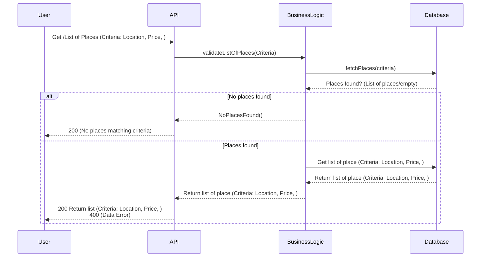

# Diagramme De Sequence List

Cliquez sur ce lien pour consulter le diagramme: [Mermaid Live Editor] (https://www.mermaidchart.com/play?utm_source=mermaid_live_editor&utm_medium=banner_ad&utm_campaign=visual_editor#pako:eNqlkU9LAzEQxb_KsKcttGwRT0EqalWEUovgrZdpdrYGtsmazAoifncTu2m33fUPmmNm3m_evHlLpMkpEYmj55q0pKnCtcXN0i41-FehZSVVhZrh0ZHt-79Y3PV9X9ZOaXJuZtZK9jVMkXGFjkIt1sOM0WTikQJuiSGbKcdgCliUKMlBemUVk1UoYGYksjJ6CAurJA1hECFe7RkH8wW8YKlyZArA-2KL29F20gORh0SPAgpi-dTI5LEsto26cxvjhal1fg5p3Kf6_M5oU_HrDoMlw9w0ta0klrrmYkxzsx1xE9rTQVsQgvBtIVQBJ-MxpHv6Bv0-Sq-hswyVjg5sf-2hHVA4V9ne7nfH-iG-B-La6r-C-xP7H7MTahv3LQXOVhayyWk4RFgZrq01dp-7zpP3D8MJLJQ)
