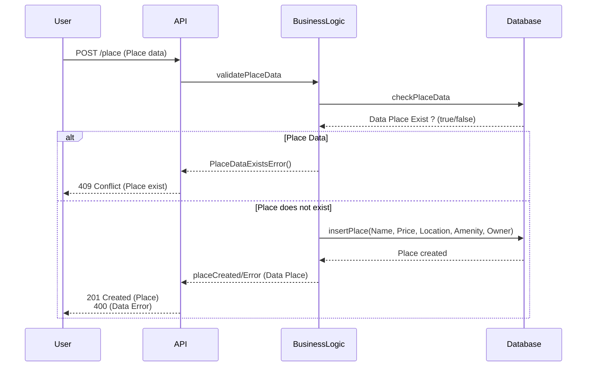

# Diagramme De Sequence Place

Cliquez sur ce lien pour consulter le diagramme: [Mermaid Live Editor](https://www.mermaidchart.com/play?utm_source=mermaid_live_editor&utm_medium=banner_ad&utm_campaign=visual_editor#pako:eNqFks1uwjAQhF9llVMigZJWXBpVIAocKqESqe2Ny-Is1GqwqW36o6rvXtuJIRHQ-mLJ-83ueOzviMmSojzS9LYnwWjKcaNwu1RLAXbtUBnO-A6FgWdN6tz5uLg_d3y311yQ1nO54ewcMEWDK9TkaqHuZvSHQ9syh2Lx-ATprkJGEBd-K60kCayFLNoZk8M7VtxS5Hk3IdAdzurC9BzYC7HXEz7U-6czXAlqQ7NPrg2MIDZqT-kaK00Hf1iZhmr3PfVyuG-w4JvqmVJSxUlb525saRdSDoPsBiZSrCvOTMiHnPIgIeumcVBK0iCkqYnLXtq5cGHnGK-PH3BLPSgUZ3abS4aGS9GD8ZYEN189WHwIUh2vf-RXW2KK7DuV_-fif8CkplOfCsTHJ7gc0HV2BY2sySeB25WCdDjIsqaFb3cMTJTRzy-hQQEq)
