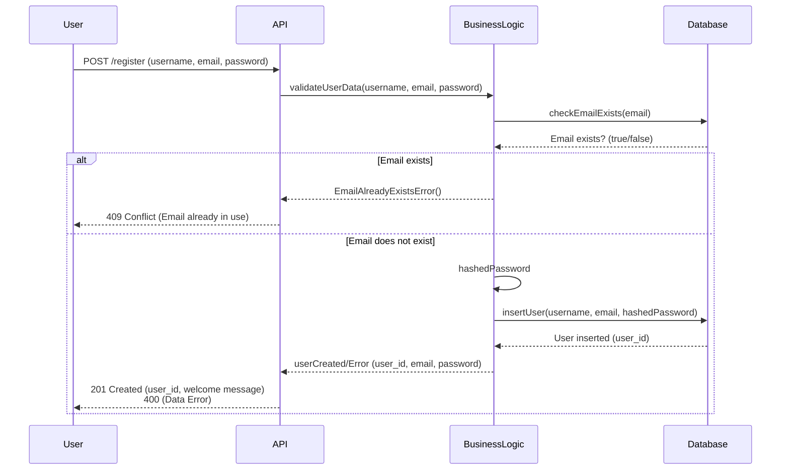

# Diagramme De Classe User

Cliquez sur ce lien pour consulter le diagramme: [Mermaid Live Editor](https://www.mermaidchart.com/play?utm_source=mermaid_live_editor&utm_medium=banner_ad&utm_campaign=visual_editor#pako:eNqNkl9LwzAUxb_KpU8dbLTKXiwymdseBMGB-jaQu-SuC7bJTFKniN_dpH-2lXbDPN7c37nnnuQnYIpTkASGPgqSjOYCU435Sq8kuLNDbQUTO5QWXg3pvvp0-dBXvi-MkGTMo0oF62uYo8U1GvJ3zb2fMZpMnGQCy6fnF4g0pcJY0hAW7k5iTkOgHEU2dGLG7JXmg4Z2mINbgxP4xExwtOSl_ch_6LQUnGLjNAG2Jfa-8Njiy9kyYSlxAJvGUddGCQGV1B2EVhcUbTAzdIAxs62upt511CRUdk8zTci_Kz8LrZUOB6eoD8UBfv0ExvENzJTcZIJZCKtpWAmAkFCc2CHnrfbDFRmQylbGzvvqLL1FsyW-rPO9BB4jFtI5td5u96Xaeq01L0TvtWpZ4tU_ehNtuj9f3zlz4TgsKpM9wOf_Tify6_gKapETfE8ZUzlB7oZiSgO4XWuIJuM4htCvAuW842NIHvz-AbBEPE8)
