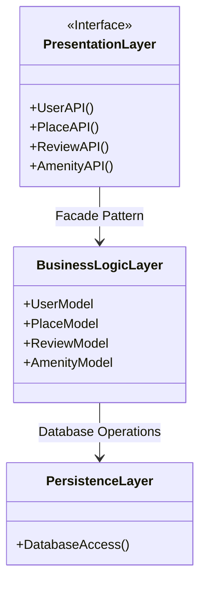
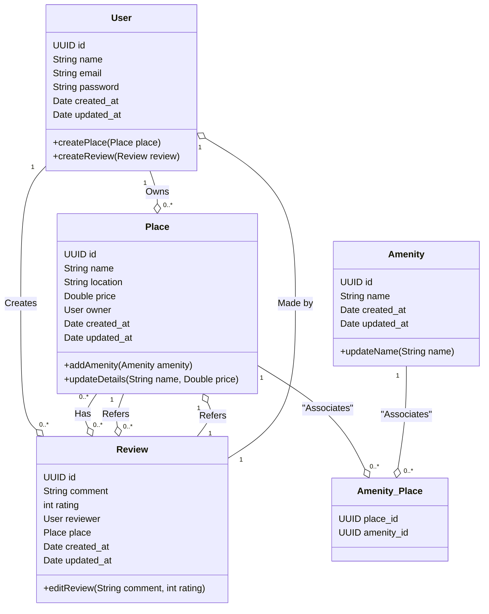
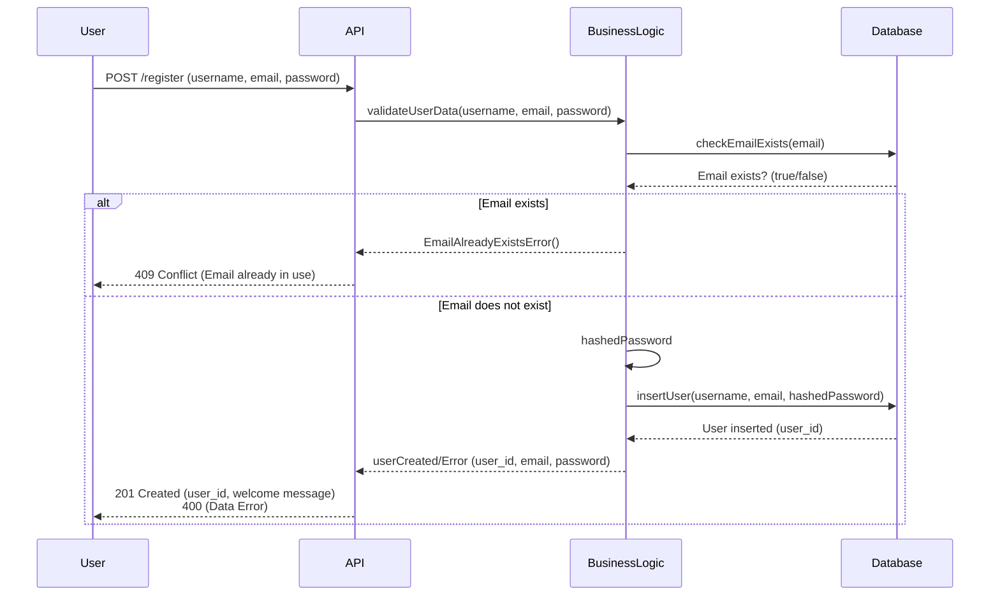
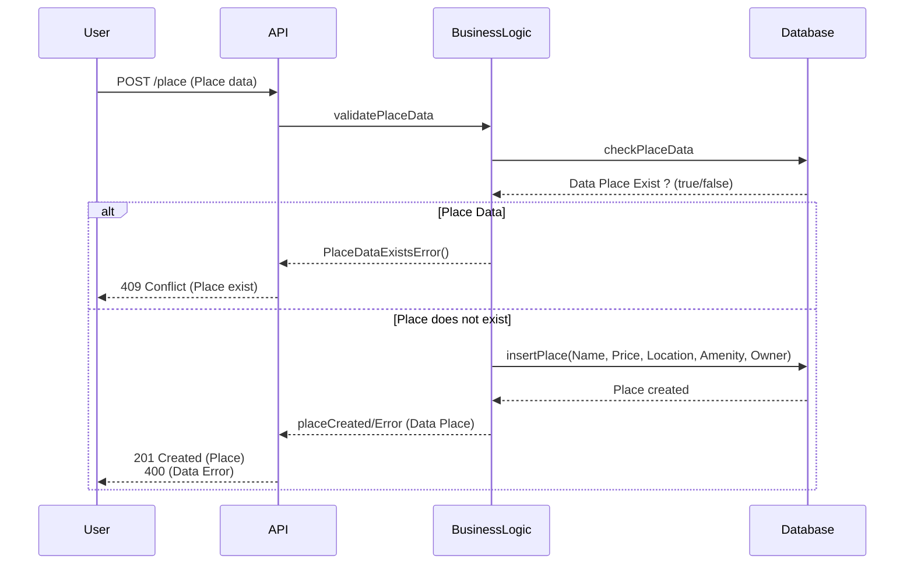
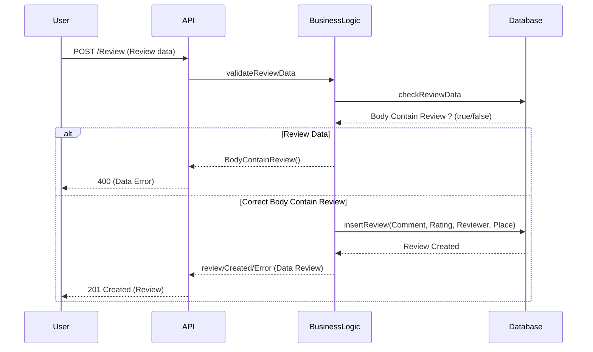
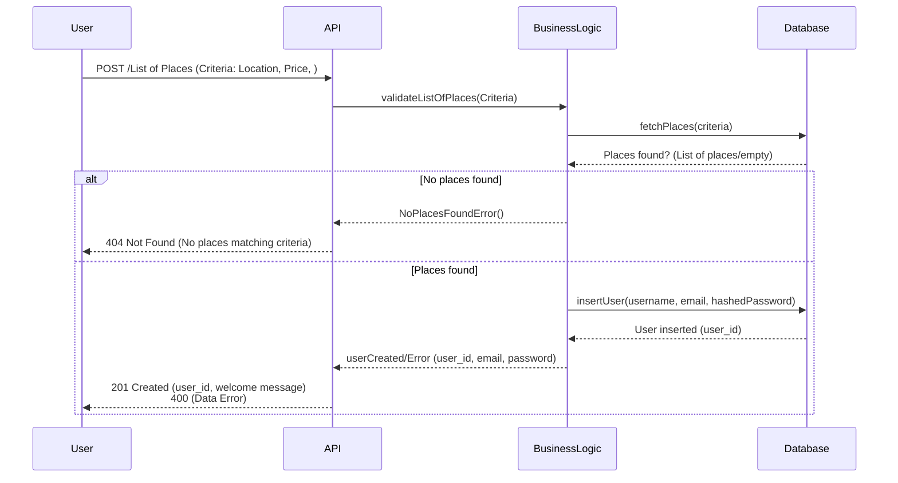

# Project HbNb

This project was carried out by: Jeremy Sousa, Lucas Legrand, Ema Decot, Mariama Goudiaby

Project Description: HBnB Evolution Documentation

Context and Objective: This project focuses on developing comprehensive technical documentation for the HBnB Evolution application, which is a simplified version of an AirBnB-like platform. The primary goal of this documentation is to serve as a blueprint for the system's architecture and design, guiding future implementation phases and ensuring clarity in the development process.

Key Features of HBnB Evolution:

User Management:
Users can register, update profiles, and be assigned roles (regular users or administrators).
Place Management:
Users can list properties with details such as name, description, price, and location.
Review Management:
Users can leave reviews for properties they have visited, including ratings and comments.
Amenity Management:
The system allows the creation and management of amenities associated with places.

Business Requirements:

User Entity: First name, last name, email, password, and administrator role.
Place Entity: Title, description, price, location, and a list of amenities.
Review Entity: Rating, comment, and association with a user and place.
Amenity Entity: Name and description.
System Architecture: The application is designed with a three-layered architecture:

Presentation Layer: API services to manage user interactions.
Business Logic Layer: Core logic, handling entities like users, places, reviews, and amenities.
Persistence Layer: Database interactions for storing and retrieving data.
Tasks and Deliverables:

High-Level Package Diagram: Illustrates the layered architecture and communication via the facade pattern.
Detailed Class Diagram: Depicts entities and their relationships in the Business Logic layer.
Sequence Diagrams: Visualizes the flow of API calls for key operations like user registration, place creation, review submission, and place listing.
The final technical document will compile these diagrams and explanations, offering a detailed and professional reference for HBnB Evolutions development.

# Diagramme UML

Description of the Uml diagram:

Cliquez sur ce lien pour consulter le diagramme: [Mermaid Live Editor](https://www.mermaidchart.com/play?utm_source=mermaid_live_editor&utm_medium=banner_ad&utm_campaign=visual_editor#pako:eNp1kcEKwjAQRH8l9KSIP1BKoSJCQTEI3ryscZRAm0o2KiL-u2m1YkncU5gZNm-SR6KaA5I0URUxzzWdLNU7uzPCT6cJacEwjpxuzJLusOLRB9rJstI42CMp5PmvMdkybCHL0XigysonQ3mDq8Yt1IsaRrv7wHi2hyHk7MLagHnZnLSKUHYwK1-1CmFC-Q0T6h-YgRGBkbCs2cEoxFDm5GhPjEIpT_ynVvjq02keq5mKBSk6QEhy_h--CyLRdkPAloqeR6zPsN2FnDxfOj2rFw)
---------------------------------------------------------------------------------------------------------------------------------------------------------

# Diagramme de classes

Description of the Classes diagram:

Cliquez sur ce lien pour consulter le diagramme: [Mermaid Live Editor](https://www.mermaidchart.com/play?utm_source=mermaid_live_editor&utm_medium=banner_ad&utm_campaign=visual_editor#pako:eNqtVE1vwjAM_StWpUndRtG49obGYTvsQ0zcKiHTBpSpTVCaghDiv89N2ioR5UOMHupiPzv2ew77IJUZC-IgzbEsJxxXCotEJQLoMT6YlUzBvvXVz2z2PgGeua4frbhYgcCC9bhZgTzv8a-p_lYqr9IENYNUMTLZHPVRqFpnPaFnm_GdY8pC84Z1_X7sAU3ZhrNtaA0oYzrcof7wCbDl_sdALlPUXApvHFktcupT8dRLMYTLrWDqDrxglo0LJrjehY0FtNanxqZPmCalytAZZuD1eY6ntv6NTN04oHV_UjG363N9NsJf2WYqC5rLO5MLDYrkFKsj2ew2-co563iHeVnGdbPBfocDp68rZJqfWmvT6NznwgSavXFCXnUzfxKMkgCiSNLXy3D4RD_sOTF8bUV5CdtIE8Or4aXD2xodrD_nDY_wpw-YsiVTHb5xuwkjp_WrwGamGD4wY7DYucw8PMD4V1YaKJIj7Uhu_gugQLGLtIxqCxuOQLdMI901rICUkikn3PLiTL6gMQXGTTIRGLTp7e28qUBw-ANs2eHu).
---------------------------------------------------------------------------------------------------------------------------------------------------------

# Diagramme De Sequence User

Description of the User sequence diagram:
The following diagram describes the API call for creating and registering a new user. This enters the data he wishes to record which is sent by the API to the system which launches the businessLogic adapted to check if the transmitted email is not already present in the database. If this is the case it returns a 409 error signifying a conflict. Once this verification is done, the password is encrypted before storing all its data in the database and returning a unique identifier to the user corresponding to their created account.

Cliquez sur ce lien pour consulter le diagramme: [Mermaid Live Editor](https://www.mermaidchart.com/play?utm_source=mermaid_live_editor&utm_medium=banner_ad&utm_campaign=visual_editor#pako:eNqNkl9LwzAUxb_KpU8dbLTKXiwymdseBMGB-jaQu-SuC7bJTFKniN_dpH-2lXbDPN7c37nnnuQnYIpTkASGPgqSjOYCU435Sq8kuLNDbQUTO5QWXg3pvvp0-dBXvi-MkGTMo0oF62uYo8U1GvJ3zb2fMZpMnGQCy6fnF4g0pcJY0hAW7k5iTkOgHEU2dGLG7JXmg4Z2mINbgxP4xExwtOSl_ch_6LQUnGLjNAG2Jfa-8Njiy9kyYSlxAJvGUddGCQGV1B2EVhcUbTAzdIAxs62upt511CRUdk8zTci_Kz8LrZUOB6eoD8UBfv0ExvENzJTcZIJZCKtpWAmAkFCc2CHnrfbDFRmQylbGzvvqLL1FsyW-rPO9BB4jFtI5td5u96Xaeq01L0TvtWpZ4tU_ehNtuj9f3zlz4TgsKpM9wOf_Tify6_gKapETfE8ZUzlB7oZiSgO4XWuIJuM4htCvAuW842NIHvz-AbBEPE8)
---------------------------------------------------------------------------------------------------------------------------------------------------------

# Diagramme De Sequence Place

Description of the Place sequence diagram:
The following diagram describes the API call for creating and saving a new location. The user enters data from a location which is sent by the API to businesslogic which will check if the location is already present in the database if this is the case it will return a conflict otherwise it will record the data in the database before returning the success or error of the registration to the user

Cliquez sur ce lien pour consulter le diagramme: [Mermaid Live Editor](https://www.mermaidchart.com/play?utm_source=mermaid_live_editor&utm_medium=banner_ad&utm_campaign=visual_editor#pako:eNqFks1uwjAQhF9llVMigZJWXBpVIAocKqESqe2Ny-Is1GqwqW36o6rvXtuJIRHQ-mLJ-83ueOzviMmSojzS9LYnwWjKcaNwu1RLAXbtUBnO-A6FgWdN6tz5uLg_d3y311yQ1nO54ewcMEWDK9TkaqHuZvSHQ9syh2Lx-ATprkJGEBd-K60kCayFLNoZk8M7VtxS5Hk3IdAdzurC9BzYC7HXEz7U-6czXAlqQ7NPrg2MIDZqT-kaK00Hf1iZhmr3PfVyuG-w4JvqmVJSxUlb525saRdSDoPsBiZSrCvOTMiHnPIgIeumcVBK0iCkqYnLXtq5cGHnGK-PH3BLPSgUZ3abS4aGS9GD8ZYEN189WHwIUh2vf-RXW2KK7DuV_-fif8CkplOfCsTHJ7gc0HV2BY2sySeB25WCdDjIsqaFb3cMTJTRzy-hQQEq)
---------------------------------------------------------------------------------------------------------------------------------------------------------

# Diagramme De Sequence Review

Description of the Review sequence diagram:
The following diagram describes the API call for creating and adding a comment about a location visited by the user. The comment sent by the user is transmitted to businessLogic by the API which will check if the comment respects the defined rules before returning a data error if this is not the case or saving the comment in the database. data and return the success or error of the operation to the user.

Cliquez sur ce lien pour consulter le diagramme: [Mermaid Live Editor](https://www.mermaidchart.com/play?utm_source=mermaid_live_editor&utm_medium=banner_ad&utm_campaign=visual_editor#pako:eNqFkkFPwkAQhf_KpKeSQEDjqQeMgAcTEwnqjcu4HXFju8XZLcYY_7uzsIttWrCXJrvfvPfmtd-JqnJKssTSR01G0ULjhrFc89qAPFtkp5XeonHwbIn7zm-Wd33Hs9pqQ9beVxut-oAFOnxBS_4u3nuP0XQqkhksHx6fYLyinaZPSMM7l6FBpAUTuGWUwQ4LLRQdBrxJxFugDMYAGag3Uu_dgQiMui6zKv-CeWUcagMh2zWkjmsav2Jh6RgSCxeBpnY3UNzbSwflw1w6aA75pQX1TWVwNZlA6mXhlrniI0iSQOIxk3J9WU-naNaijZi4EGJelSUZN4QVOm02w6BEPIRlgYpaIc80F7qYM8lHyv-vg_d8wMf7NcPKB6XT5VxOLqJN_H_-CjJ58vMLcBP9bA)
---------------------------------------------------------------------------------------------------------------------------------------------------------

# Diagramme De Sequence List

Description of the List sequence diagram:
The following diagram describes the API call for requesting a location list. The user enters criteria sent by the API to the business logic which will check in the database the places corresponding to the criteria entered by user. If no location is found a 404 error is returned otherwise a list matching the criteria and sent back to the user.

Cliquez sur ce lien pour consulter le diagramme: [Mermaid Live Editor](https://www.mermaidchart.com/play?utm_source=mermaid_live_editor&utm_medium=banner_ad&utm_campaign=visual_editor#pako:eNp9UU1Lw0AQ_StDTim0JEpPQSraKgilDai3gkw3k3Qh2Y27G4uI_93dNEkbE80hh5n3NW-_PCYT8iJP03tFgtGKY6aw2KmdAPuVqAxnvERh4FWTGpvfxU9j4_tKc0Far2XG2RhghQb3qMnt2r3zmC0WVjKCePv8AsGaawMyhThHRhr8peKGFMcI1pKh4VJMIVac0RQmrYqlW5FegAg-MOcJGnKC2_Qk16l11B7JirQhI0jJsENDY79pLWw29G2Cp7ISyS347T1lPQ6oKM1nJ4O5gY1sdidKuxqGa3vayJPFo4M_KCWVP7lkuTYs1lUbwTycW4KBGgz-2axAex4XGQxuo1xT74q_I132xYU1NM7Vr-xPYGGfiArk-RQOqA-UxKj1Uaqkl_afJp1WI0s2u1N94332eEMOuVRkHz8J6oI6cpeoHMvSa-46vIJG5IJ-pJzJgqCwppjRBG72CoLFPAzBd6dA7XfuUiTe9w-kKycA)
