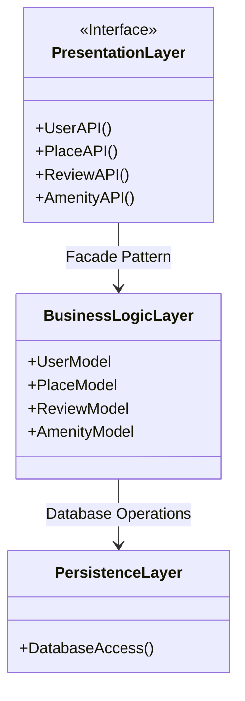

# Diagramme UML

Cliquez sur ce lien pour consulter le diagramme: [Mermaid Live Editor](https://www.mermaidchart.com/play?utm_source=mermaid_live_editor&utm_medium=banner_ad&utm_campaign=visual_editor#pako:eNp1kcEKwjAQRH8l9KSIP1BKoSJCQTEI3ryscZRAm0o2KiL-u2m1YkncU5gZNm-SR6KaA5I0URUxzzWdLNU7uzPCT6cJacEwjpxuzJLusOLRB9rJstI42CMp5PmvMdkybCHL0XigysonQ3mDq8Yt1IsaRrv7wHi2hyHk7MLagHnZnLSKUHYwK1-1CmFC-Q0T6h-YgRGBkbCs2cEoxFDm5GhPjEIpT_ynVvjq02keq5mKBSk6QEhy_h--CyLRdkPAloqeR6zPsN2FnDxfOj2rFw)
