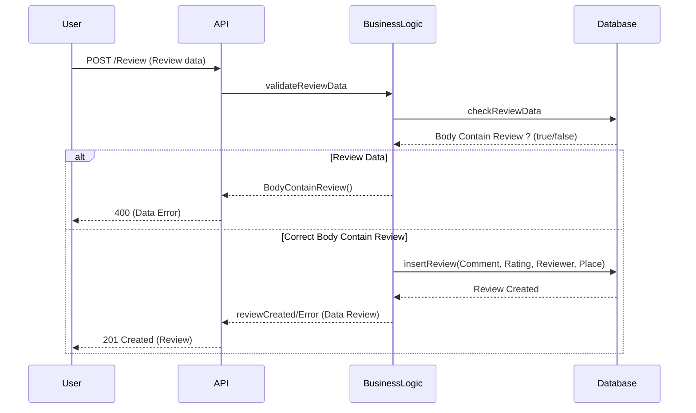

# Diagramme De Classe Review

Cliquez sur ce lien pour consulter le diagramme: [Mermaid Live Editor](https://www.mermaidchart.com/play?utm_source=mermaid_live_editor&utm_medium=banner_ad&utm_campaign=visual_editor#pako:eNqFkkFPwkAQhf_KpKeSQEDjqQeMgAcTEwnqjcu4HXFju8XZLcYY_7uzsIttWrCXJrvfvPfmtd-JqnJKssTSR01G0ULjhrFc89qAPFtkp5XeonHwbIn7zm-Wd33Hs9pqQ9beVxut-oAFOnxBS_4u3nuP0XQqkhksHx6fYLyinaZPSMM7l6FBpAUTuGWUwQ4LLRQdBrxJxFugDMYAGag3Uu_dgQiMui6zKv-CeWUcagMh2zWkjmsav2Jh6RgSCxeBpnY3UNzbSwflw1w6aA75pQX1TWVwNZlA6mXhlrniI0iSQOIxk3J9WU-naNaijZi4EGJelSUZN4QVOm02w6BEPIRlgYpaIc80F7qYM8lHyv-vg_d8wMf7NcPKB6XT5VxOLqJN_H_-CjJ58vMLcBP9bA)
